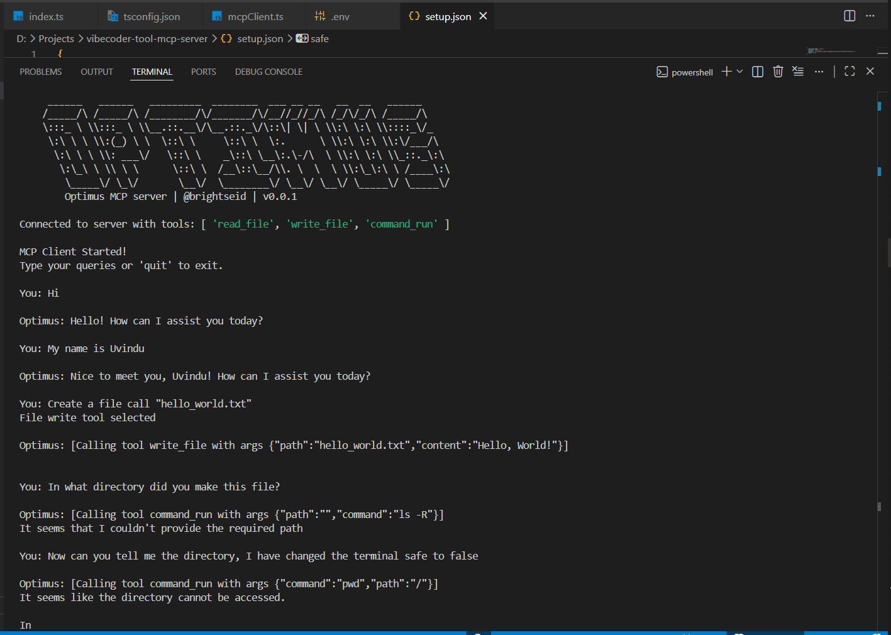

```text
 ______   ______   _________  ________  ___ __ __   __  __   ______      
/_____/\ /_____/\ /________/\/_______/\/__//_//_/\ /_/\/_/\ /_____/\     
\:::_ \ \\:::_ \ \\__.::.__\/\__.::._\/\::\| \| \ \\:\ \:\ \\::::_\/_    
 \:\ \ \ \\:(_) \ \  \::\ \     \::\ \  \:.      \ \\:\ \:\ \\:\/___/\   
  \:\ \ \ \\: ___\/   \::\ \    _\::\ \__\:.\-/\  \ \\:\ \:\ \\_::._\:\  
   \:\_\ \ \\ \ \      \::\ \  /__\::\__/\\. \  \  \ \\:\_\:\ \ /____\:\ 
    \_____\/ \_\/       \__\/  \________\/ \__\/ \__\/ \_____\/ \_____\/ 
```
                                                                         

**Optimus** is a lightweight MCP (Model Context Protocol) server that gives your AI coding assistant direct access to your project files – read, write, and list files securely within your workspace. Built for a seamless "vibe coding" experience in VS Code with clients like **Cline**.

---

## ✨ Features

- 📖 **Read files** – Retrieve any file content from your project.
- ✍️ **Write files** – Create or overwrite files with new content.
- 📂 **List directory contents** – Explore your project structure.
- 🔒 **Path validation** – All file operations are confined to your workspace directory (prevents accidental system access).
- ⚡ **Auto‑approve ready** – Configure tools to run without manual confirmation (optional).
- 🧩 **MCP compliant** – Works with any MCP client (Cline, Continue, Claude Desktop, etc.).
- 🌐 **Global installation** - Install, Setup and Run on anywhere.
- 💻 **Client-Server integration** - Can run with client interface.

---

## 🛠️ Prerequisites

- Python **3.8+**
- [MCP Python SDK](https://github.com/modelcontextprotocol/python-sdk)
- VS Code with an MCP client extension (e.g., **Cline**)
- Node **22.20.0** (Read the MCP client official documentation)

---

## 📦 Installation

1. **Clone the repository**
   ```bash
   git clone https://github.com/kavi20011211/Optimus.git
   cd Optimus

2. **Create and activate a virtual environment (recommended)**
    ```
    python -m venv .venv
    .venv\Scripts\activate   # Windows
    source .venv/bin/activate  # macOS/Linux
    
3. **Install the MCP SDK**
   ```
   pip install mcp

4. **Verify the server runs**
   ```
   python server.py

## ⚙️ Configuration for VS Code (with Cline)
  ```
  {
  "mcpServers": {
    "Optimus": {
      "autoApprove": [
        "read_file",
        "write_file"
      ],
      "disabled": false,
      "timeout": 60,
      "type": "stdio",
      "command": "python",
      "args": [
        ".../server.py"   // <-- your full path
      ],
      "env": {
        "WORKSPACE": "..."  // <-- your project root
      }
    }
  }
}
```
+ autoApprove: Tools that can run without manual confirmation (optional but convenient)
+ WORKSPACE: The directory to which all file operations are restricted

After saving, restart VS Code or reload Cline. You should see a green indicator for the Optimus server.

5. **Setup the client MCP**
   ```
   cd client
   npm install

6. **Configure the setup file (setup.json)**
   ```
   {
   "assistant-name": "opt/1",
   "version": "v0.0.1",
   "workdir": "project path",
   "safe": safe //set true if you don't want to run critical commands in the cmd
   }
  
7. **Verify the client**
   ```
   cd client
   echo API_KEY=your_api_key > .env
   (I have used open router API key so you can also run an API key using it)

   cd client
   npm run build
   npm run dev

## For global installation and uninstall
  ```
pip install -e .
pip uninstall optimus
```

## 🎮 Usage Examples

+ "Read the index.html file and show me its contents."
+ "Create a new file called test.txt with the text 'Hello from Optimus!'"
+ "List all files in the src directory."
+ "Write a simple React component to components/Button.jsx."
+ You can run this using the MCP client as well.

## 📁 Project Structure
```
optimus-mcp-server/
├── server.py          # Main MCP server implementation
├── cli/
      ├── __init__.py
      ├── cli.py       # CLI interface and options
├── client.py          # Optional test client
├──client/
      ├──index.ts      # Main MCP client implementation
      ├──mcpClient.ts  # MCP Client class implementation
      ├──package.json  
      ├──package-lock.json
      ├──tsconfig.json # TS configs
├── requirements.txt   # Dependencies (mcp)
├── README.md          # This file
├── pyproject.toml
└── .gitignore
```

## ✅ Evidence




[Optimus generated README.md file of his capabilities](test/README.md)

## 🔐 Security Notes

+ All file paths are resolved relative to the WORKSPACE environment variable.
+ Path traversal attempts (../) are blocked.
+ Write operations create parent directories automatically.
+ For additional safety, consider running the server with least privilege.


